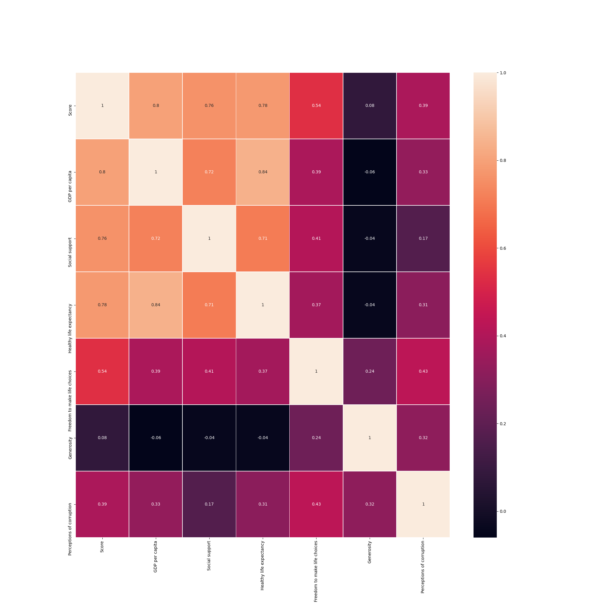
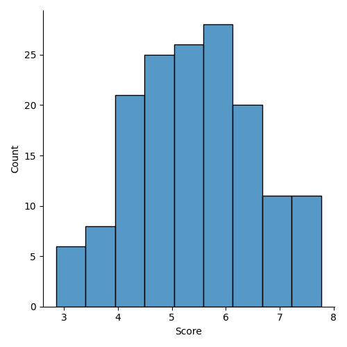
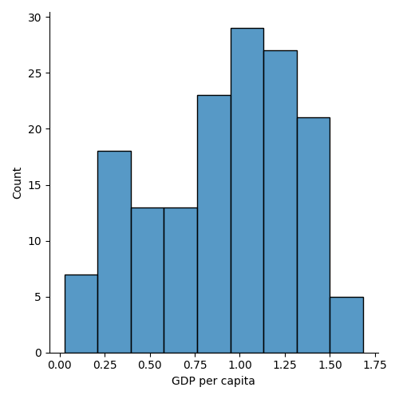
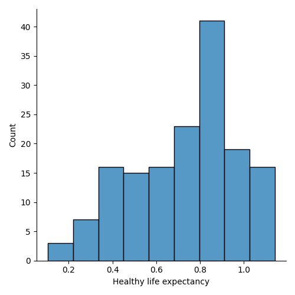
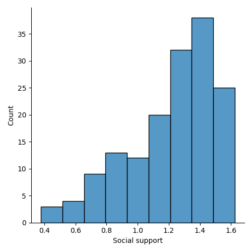

# ICY0006 Project
**Manuel Trinidad Morales - 184064 IVSB**

## Description
The [World Happiness Report](https://worldhappiness.report/) is a study done annually to quantify the happiness of a country. The study analyzes the total value of _Happiness_ from 0 - 10, as well as other variables like the _GDP_, _Corruption_,  _Freedom_, etc.

The goal of my study is to find if there is a relation between the __Happiness of a Country__ / `Score` and all the other variables. For this study I am using the [World Happiness Report dataset in Kaggle](https://www.kaggle.com/unsdsn/world-happiness?select=2019.csv) which parsed all the variables from the report to a `.csv` file. For the analysis I am using Python and all the requirements in `requirements.txt`. Each stage of the study has its own file.

---

**NB** While the `True` meaning of _happiness_ is a concern those studying Philosophy, I will treat it like an Engineer; as a `Number`. Maybe with this study, we may even find out what this thing `Happiness` is made of. 

## Instructions

All the code for this study is available in this repo. Just make sure to install `requirements.txt`. Run each stage as you wish.

## Stage 1

For this part I wanted to get acquainted with the data. For this, `results/data_overview.txt` is generated. It contains information like variable types, variable examples, etc. Then I preprocessed the data. For this specific analysis, it became apparent that columns `Country or region` and `Overall rank` are purely informational and hold no statistical meaning, so I removed them. At last, I filled the empty values with `0` or `NaN`.

After preprocessing the data, I wanted to know which variables had the most impact to `Score`. For this I created a correlation matrix in `results/correlation_matrix.png`. The analysis of it showed that the variables `GDP per capita`,  `Social support` and `Healthy life expectancy` have a  great linear correlation with the target variable. So these are the variables I will be using further in my study.

Lastly, I did a **Distribution Histogram** of the relevant variables, with some interesting information regarding the data.

**Score** seems to have a normal distribution with a mode of around 6. The minimum is 3 and the maximum is 8. This also tells me that there seem to be as many _happy_ countries as there are _unhappy_ ones.

**GDP per Capita** has a spike impeding it to have a normal distribution. It is slightly biased towards the right, which tells me that there's plenty of countries having better GDP per capita than those that don't have it in average.

**Healthy Life Expectancy** has a great spike in its mode, telling me that a great number of countries enjoy a certain HLE, although the other ones are distributed equally on the other sides of the spike.

**Social Support** has a big trend towards the right. The fact that most countries have a great Social Support tells me that having a good value on this variable may not be a big factor.

## Stage 2

All the measurements can be found as `results/tendency_measures.txt` and `results/variability_measures.txt`.

**Tendency Variables** These aren't giving much new information that isn't already visual; I can tell that it aligns with what the graphs say. If anything, it was interesting to find that `Healthy Life Expectancy` is bimodal.

**Variability Measures** This part threw some interesting results. Range in this case could have been really important, but since all the data is in different units / ratios, it doesn't apply. The *Standard Deviation* however, let me know that most of the values in `Score` are very close to the mean, compared to those in the other columns. Probably the overall combinaiton of these variables leads to a unified `Score`.

