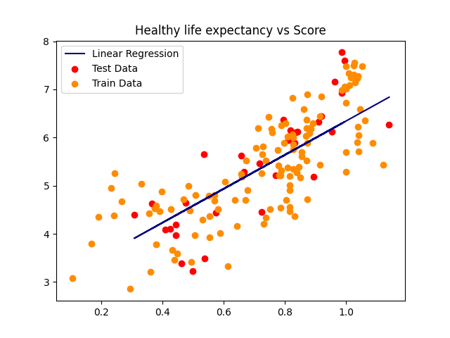

# ICY0006 Project
**Manuel Trinidad Morales - 184064 IVSB**

## Description
The [World Happiness Report](https://worldhappiness.report/) is a study done annually to quantify the happiness of a country. The study analyzes the total value of _Happiness_ from 0 - 10, as well as other variables like the _GDP_, _Corruption_,  _Freedom_, etc.

The goal of my study is to find if there is a relation between the __Happiness of a Country__ / `Score` and all the other variables. For this study I am using the [World Happiness Report dataset in Kaggle](https://www.kaggle.com/unsdsn/world-happiness?select=2019.csv) which parsed all the variables from the report to a `.csv` file. For the analysis I am using Python and all the requirements in `requirements.txt`. Each stage of the study has its own file.

---

**NB** While the `True` meaning of _happiness_ is a concern those studying Philosophy, I will treat it like an Engineer; as a `Number`. Maybe with this study, we may even find out what this thing `Happiness` is made of. 

## Instructions

All the code for this study is available in this repo. Just make sure to install `requirements.txt`. Run each stage as you wish.

## Stage 1

For this part I wanted to get acquainted with the data. For this, `results/data_overview.txt` is generated. It contains information like variable types, variable examples, etc. Then I preprocessed the data. For this specific analysis, it became apparent that columns `Country or region` and `Overall rank` are purely informational and hold no statistical meaning, so I removed them. At last, I filled the empty values with `0` or `NaN`.

After preprocessing the data, I wanted to know which variables had the most impact to `Score`. For this I created a correlation matrix in `results/correlation_matrix.png`. The analysis of it showed that the variables `GDP per capita`,  `Social support` and `Healthy life expectancy` have a  great linear correlation with the target variable. So these are the variables I will be using further in my study.


Lastly, I did a **Distribution Histogram** of the relevant variables, with some interesting information regarding the data.

**Score** seems to have a normal distribution with a mode of around 6. The minimum is 3 and the maximum is 8. This also tells me that there seem to be as many _happy_ countries as there are _unhappy_ ones.


**GDP per Capita** has a spike impeding it to have a normal distribution. It is slightly biased towards the right, which tells me that there's plenty of countries having better GDP per capita than those that don't have it in average.


**Healthy Life Expectancy** has a great spike in its mode, telling me that a great number of countries enjoy a certain HLE, although the other ones are distributed equally on the other sides of the spike.


**Social Support** has a big trend towards the right. The fact that most countries have a great Social Support tells me that having a good value on this variable may not be a big factor.


## Stage 2

All the measurements can be found as `results/tendency_measures.txt` and `results/variability_measures.txt`.

**Tendency Variables** These aren't giving much new information that isn't already visual; I can tell that it aligns with what the graphs say. If anything, it was interesting to find that `Healthy Life Expectancy` is bimodal.

**Variability Measures** This part threw some interesting results. Range in this case could have been really important, but since all the data is in different units / ratios, it doesn't apply. The *Standard Deviation* however, let me know that most of the values in `Score` are very close to the mean, compared to those in the other columns. Probably the overall combinaiton of these variables leads to a unified `Score`.

## Stage 3

The **Correlation Matrix** was done in the first step, as well as the analysis on it, so please refer to that part.

---

For the Scatter plot, I will be using `GDP per capita`,  `Social support` and `Healthy life expectancy` as independent variables for the analysis. `Score` still being the dependent variable. I tried both **Linear** and **Polynomial** Regression using [scikit-learn](https://scikit-learn.org/).


I found that, even though there seems to be a correlation between `GDP per capita` and `Score`, visually it may not seem like so. There's a lot of scattering, although it does seem to follow the line of the regression.


On the other hand, **Polynomial Regression** had some interesting results. Maybe the lows can be considered outliers in this case.

All the 6 Regressions can be found at `results/{linear | polynomial}_regression_{x}_vs_{y}.png`

## Stage 4


I picked Mexican [Melate](https://pronosticos.gob.mx/paginas/melate/melate) for my Stage 4 task. The rules are simple: There's a total of 56 unique numbers, of which you play 6. The raffle happens very Wednesday and Sunday. The raffle consists of picking up 6 numbers called _natural_ and 1 number called _additional_. If your 6 numbers match the _natural_ numbers, you win **1st Place**, if 5 of your numbers match the _natural_ numbers and the _additional_ you win **2nd Place**. This goes until only 2 of your numbers match the _natural_ numbers, which is last place. The prize calculated from a total prize pool and is shared between places.

---

My analysis will be of the probabilities to win all the places. Since the order of numbers in the set doesn't matter, and there is no repetition, I will be using the combinatorics `n! / r! (n-r)!` applied to the code I wrote in `stage4.py` to calculate the probabilities.

| Place | Numbers | Probability  |
| ----- | ------- | ------------ |
| 1     | 6n      | 1:32,468,436 |
| 2     | 5n+a    | 1:5,411,406  |
| 3     | 5n      | 1:108,229    |
| 4     | 4n+a    | 1:88,350     |
| 5     | 4n      | 1:1,767      |
| 6     | 3n+a    | 1:4,142      |
| 7     | 3n      | 1:83         |
| 8     | 2n+a    | 1:470        |
| 9     | 2n      | 1:10         |

## Stage 5

I am still working with the World Happiness Report for the last stage of the project. For this specific task, I have decided to use `GDP per capita`,  `Social support` and `Healthy life expectancy` since they have the most impact on `Score`. The regressions I will be doing are **Linear** and **Polynomial**. The regressions and data management is handled by `scikit-learn`.

### Step 1

Dividing the data happens randomly for each regression. 20% of the data frame goes to the `test` dataset and the 80% left is for the `train` data frame.

```python
from sklearn.model_selection import train_test_split

x_train, x_test, y_train, y_test = train_test_split(x, y, test_size=0.20)
```

### Step 2

Training the models is done through `LinearRegression` and `SVR`. 

```python
from sklearn.linear_model import LinearRegression

clf = LinearRegression()
clf.fit(x_train, y_train)
y_pred = clf.predict(x_test)
```

```python
from sklearn.svm import SVR

clf = SVR(kernel='poly', C=100, gamma='auto', degree=3, epsilon=.1, coef0=1)
clf.fit(x_train, y_train)
y_pred = clf.predict(x_test)
```

### Step 3

To evaluate the performance of the model, I applied both `RMSE` and `MAE`. 

```python
from sklearn.metrics import mean_squared_error, mean_absolute_error

rmse = sqrt(mean_squared_error(y_test, y_pred))
mae = mean_absolute_error(y_test, y_pred)
```

The results of both metrics was printed out into `results/test_{x}_vs_{y}_{regression}.txt` for each of the model regressions and their testing data.

### Report

Reading the data of both type of metrics confirms that there seems to be a correlation between the independent and dependent variables, but it's not as strong as it would seem by the _Correlation Matrix_. With a trained model's visual and numerical figures, we can draw some conclusions regarding the data.

The most important finding of this study: We can predict the values of `Score` based on any of the independent values **with a great margin of error**. Most of the metric tests show results that range from **0.40** to **0.80**. This would mean that, in the best scenario, we can be off for about half a point of the real score for any given independent variable.

However, there's a caveat to this. If the model was to accept a relative margin of error, it would have a far greater result. Take `Social support` vs `Score` with the `Polynomial` regression for instance. Although the `MAE` score is the best in the whole set of metrics, it can be even better. It appears as if the points get scattered more the worse the `Social support` score is. This means that we could adjust the model to that specific range with a lower margin of error and get more accurate results.


---

Second, the strongest correlation seems to be between `GDP per capita` and `Score` with `Linear Regression` as the model. This can be confirmed both visually and numerically since the `MAE` value is the lowest: **0.56** and, as mentioned before, `Social support` vs `Score` with `Polynomial` regression has the best metrics. Both of these can also be confirmed visually, unlike `Healthy life expectancy` vs `Score` on `Linear` regression, which has good metrics, but there's visually a curvature on the data.



